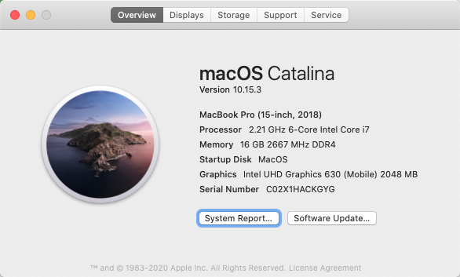

# Flymin's Hackintosh profile on Thinkpad X1E

   

## Update

##### Recent | [Changelog Archive](https://github.com/flymin/Hackintosh-Thinkpad-X1-Extreme/blob/master/UPDATES.md)

- [20201103] Update opencore to 0.6.3 and kexts.
- [20201007] Update opencore to 0.6.2 and kexts.
- [20200926] Update to 10.15.7, everything works fine.

## ATTENTION

- Opencore is way too convenient for hackintosher to make their own EFI !!! see [vanilla's guide](https://khronokernel-2.gitbook.io/opencore-vanilla-desktop-guide/)
- The opencore version of my project mostly refer to [zysuper's repo](https://github.com/zysuper/Thinkpad-X1-extreme-EFI)
- You need to fill out the **PlatformInfo** part to use my config of opencore

## Hardware: Thinkpad X1 Extreme Gen 1

- CPU: Core i7-8750H 2.2GHz
- Memory: 16G 2667MHz DDR4
- SSD1: intel 7600P SSDPEKKF256G8L
- SSD2: Intel 760P  SSDPEKKW256G8
- Display: 1080p, non-touch
- Graphics: Intel UHD Graphics 630
- Wireless: Broadcom BCM943602CS
- Sound card: Realtek ALC285
- BIOS: v1.24
- OS: OS X Catalina 10.15.7

## Result

### What works

- Base OS
- Sleep, wakeup, hibernation
- Brightness, function keys for brightness control, NightShift
- Intel Ethernet LAN (mini RJ45) and WIFI
- Touchpad and TrackPoint
- Audio, function keys for volume control, headphone jack
- USB 3.1 ports, USB-C ports (only can be connected to USB 3.0 devices)

### What doesn't work

- Function keys Fn+F4, Fn+F7-F12
- Smooth brightness adjustment
- Nvidia Graphics Card 1050Ti
- Thunderbolt 3 (not tested, have no usable eGPU)
- HDMI output to external display

### Known Issue

- [Fixed] For releases prior to commit [#f1fc8ce](https://github.com/flymin/Hackintosh-Thinkpad-X1-Extreme/commit/f1fc8ce9e9c6eed0708d520e2a6d5e2b6abba95e), I used a auto-reload script to make audio card available everytime I log in. However, this may cause a Kernal Panic when wake up from sleep. Layout 31 do not need this.
- [Fixed] ~~Sometiimes headphone may not work after sleep (however, internal speaker can always work well). The [ALCPlugFix](https://github.com/goodwin/ALCPlugFix) can be used to fix the issue, see [my modified version](https://github.com/flymin/HackintoshTools-Thinkpad-X1E/tree/master/ALCPlugFix)~~. For Catalina, you need to **re**install this if you have installed before.
- [Fixed] Fan control by [wdde](https://github.com/wdde) in this [issue#45](https://github.com/Errrneist/Hackintosh-Thinkpad-X1-Extreme/issues/45), see [here](https://github.com/flymin/HackintoshTools-Thinkpad-X1E#fan-control) for instructions.
- [Solved for now] AirPods may not work smmothly after waking up from sleep. I don't think it is the problem of AppleALC,  but possibly BlueTooth. You can avoid this by turn off Automatic Ear Detection, [see](https://github.com/flymin/Hackintosh-Thinkpad-X1-Extreme/blob/master/IMG/airpods.png).

## Add-ons

### ~~DSDT patch~~

- ~~Battery level display (directly use RehabMan/thinkpad x230i patch)~~
- ~~Keyboard function keys, volume and screen brightness (DSDT EC _Q14, _Q15 patch), [see](https://github.com/zysuper/Thinkpad-X1-extreme-EFI/issues/18#issuecomment-502606377).~~
- ~~Audio Layout (change any one of the patches and change layout id to 31, this may remain rudimentary with alcid=31 in conflg.plist)~~

### kext modifications

- Customized AppleALC.kext

  Set `alcid=31` in `E/C/config.plist`. I made a custom version to ALC285 with layout 31, see [pull #442](https://github.com/acidanthera/AppleALC/pull/442) and my [codec#0 paths](https://github.com/flymin/Hackintosh-Thinkpad-X1-Extreme/blob/master/IMG/codec%230.svg)
  
- Deleted VoodooI2C*.kext

  kexts above will cause about 5min boot lag for machines have no I2C devices
  
- [2019.9.10] Use [acidanthera](https://github.com/acidanthera?type=source)'s version of [VoodooPS2](https://github.com/acidanthera/VoodooPS2)

  This is the first version that makes trick point, gesture and buttons on the track pad all usable. Thanks to [wdde](https://github.com/wdde) in [this issue](https://github.com/Errrneist/Hackintosh-Thinkpad-X1-Extreme/issues/40#issuecomment-529308480).

## Acknowledgements

- [zysuper's Hackintosh](https://github.com/zysuper/Thinkpad-X1-extreme-EFI)
- 我认为最详细的 Opencore 配置解读：[独行秀才的老窝](https://shuiyunxc.gitee.io/)
- Opencore 补丁库 [OC-little](https://github.com/daliansky/OC-little)
- This repo previously is a fork repo of [Errrneist's repo](https://github.com/Errrneist/Hackintosh-Thinkpad-X1-Extreme). Since we have different hardwares, I reconsider configurarions in this repo as a standalone version.
- [20191109] older release details and fork information could be found in the **Archived version** for this repo, [here](https://github.com/flymin/Hackintosh-Thinkpad-X1-Extreme_fork/releases). (I cannot import those to this new repo)
- [darkal's Hackintosh](https://github.com/darkal/Hackintosh-Thinkpad-X1-Extreme)
  - same 8750H version, works fine on mine. See [Release 10.14.6 v1.0](https://github.com/flymin/Hackintosh-Thinkpad-X1-Extreme/releases/tag/v10.14.6.1.0)
- [xuzhao9's Hackintosh](https://github.com/xuzhao9/ThinkPad-X1E-Hackintosh)
  - we have very similiar hardware configs, but his DSDT table won't work on mine. You can try it out if there are some problems with my version. 
- [RehabMan's DSDT patches](https://github.com/RehabMan/Laptop-DSDT-Patch)
- [Telegram Hackintosh Group](https://t.me/joinchat/FSuP2UI4ALt1uIVmQ5E6lg)
